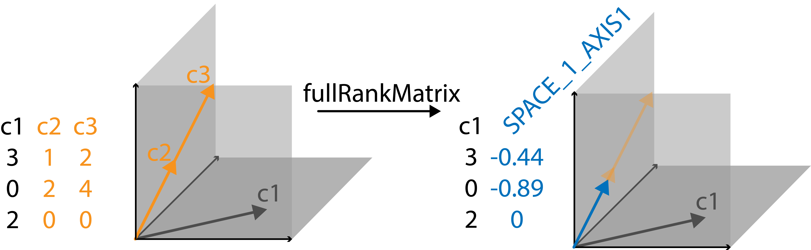

<!-- README.md is generated from README.Rmd. Please edit that file -->

# fullRankMatrix - Generation of Full Rank Design Matrix

<!-- badges: start -->
<!-- badges: end -->


We developed `fullRankMatrix` primarily for one-hot encoded design
matrices used in linear models. In our case, we were faced with a 1-hot
encoded design matrix, that had a lot of linearly dependent columns.
This happened when modelling a lot of interaction terms. Since fitting a
linear model on a design matrix with linearly dependent columns will
produce results that can lead to misleading interpretation (s. example
below), we decided to develop a package that will help with identifying
linearly dependent columns and replacing them with columns constructed
of orthogonal vectors that span the space of the previously linearly
dependent columns.

The goal of `fullRankMatrix` is to remove empty columns (contain only
0’s), merge duplicated columns (containing the same entries) and merge
linearly dependent columns. These operations will create a matrix of
full rank. The changes made to the columns are reflected in the column
headers such that the columns can still be interpreted if the matrix is
used in e.g. a linear model fit.

## Installation

You can install `fullRankMatrix` directly from CRAN. Just paste the
following snippet into your R console:

``` r
install.packages("fullRankMatrix")
```

You can install the development version of `fullRankMatrix` from
[GitHub](https://github.com/Pweidemueller/fullRankMatrix) with:

``` r
# install.packages("devtools")
devtools::install_github("Pweidemueller/fullRankMatrix")
```

## Citation

If you want to cite this package in a publication, you can run the
following command in your R console:

``` r
citation("fullRankMatrix")
#> To cite package 'fullRankMatrix' in publications use:
#> 
#>   Weidemueller P, Ahlmann-Eltze C (2023). _fullRankMatrix: Produce a
#>   Full Rank Matrix_. R package version 0.1.0,
#>   <https://github.com/Pweidemueller/fullRankMatrix>.
#> 
#> A BibTeX entry for LaTeX users is
#> 
#>   @Manual{,
#>     title = {fullRankMatrix: Produce a Full Rank Matrix},
#>     author = {Paula Weidemueller and Constantin Ahlmann-Eltze},
#>     year = {2023},
#>     note = {R package version 0.1.0},
#>     url = {https://github.com/Pweidemueller/fullRankMatrix},
#>   }
```

## Linearly dependent columns span a space of a certain dimension

In order to visualize it, let’s look at a very simple example. Say we
have a matrix with three columns, each with three entries. These columns
can be visualized as vectors in a coordinate system with 3 axes (s.
image). The first vector points into the plane spanned by the first and
third axis. The second and third vectors lie in the plane spanned by the
first and second axis. Since this is a very simple example, we
immediately spot that the third column is a multiple of the second
column. Their corresponding vectors lie perfectly on top of each other.
This means instead of the two columns spanning a 2D space they just
occupy a line, i.e. a 1D space. This is identified by `fullRankMatrix`,
which replaces these two linearly dependent columns with one vector that
describes the 1D space in which column 2 and column 3 used to lie. The
resulting matrix is now full rank with no linearly dependent columns.

``` r
library(fullRankMatrix)
```

``` r
c1 <- c(1, 0, 1)
c2 <- c(1, 2, 0)
c3 <- c(2, 4, 0)

mat <- cbind(c1, c2, c3)

make_full_rank_matrix(mat)
#> $matrix
#>      c1 SPACE_1_AXIS1
#> [1,]  1    -0.4472136
#> [2,]  0    -0.8944272
#> [3,]  1     0.0000000
#> 
#> $space_list
#> $space_list$SPACE_1
#> [1] "c2" "c3"
```

``` r

```

<div class="figure">


<p class="caption">
Visualisation of identifying and replacing linearly dependent columns.
</p>

</div>

## Worked through example

Above was a rather abstract example that was easy to visualize, let’s
now walk through the utilities of `fullRankMatrix` when applied to a
more realistic design matrix.

When using linear models you should check if any of the columns in your
design matrix are linearly dependent. If there are, this will alter the
interpretation of the fit. Here is a rather constructed example where we
are interested in identifying the factors that make fruit sweet. We can
classify fruit into what fruit type they are and also at what season
they were harvested in.

``` r
# let's say we have 10 fruits and can classify them into strawberries, apples or pears
# in addition we indicate in which season(s) they are typically harvested
strawberry <- c(1,1,1,1,0,0,0,0,0,0)
apple <- c(0,0,0,0,1,1,1,0,0,0)
pear <- c(0,0,0,1,0,0,0,1,1,1)
spring <- c(1,1,0,0,0,0,0,0,0,0)
summer <- c(1,1,1,1,1,1,1,0,0,0)
fall <- c(0,0,0,0,0,0,1,1,1,1)

# let's pretend we know how each factor influences the sweetness of a fruit
# in this case we say that strawberry and summer have the biggest influence on sweetness
strawberry_sweet <- strawberry * rnorm(10, 4)
apple_sweet <- apple * rnorm(10, 1)
pear_sweet <- pear * rnorm(10, 0.5)
spring_sweet <- spring * rnorm(10, 2)
summer_sweet <- summer * rnorm(10, 5)
fall_sweet <- fall * rnorm(10, 1)

sweetness <- strawberry_sweet + apple_sweet + pear_sweet +
  spring_sweet + summer_sweet + fall_sweet

mat <- as.matrix(data.frame(strawberry,apple,pear,spring,summer,fall))

fit <- lm(sweetness ~ mat + 0)
print(summary(fit))
#> 
#> Call:
#> lm(formula = sweetness ~ mat + 0)
#> 
#> Residuals:
#>       1       2       3       4       5       6       7       8       9      10 
#> -1.0313  1.0313  0.7344 -0.7344 -1.1717  1.9061 -0.7344 -0.9273 -0.1276  1.7892 
#> 
#> Coefficients: (1 not defined because of singularities)
#>               Estimate Std. Error t value Pr(>|t|)   
#> matstrawberry    9.326      1.377   6.772  0.00107 **
#> matapple         4.623      1.056   4.377  0.00717 **
#> matpear         -1.782      1.567  -1.138  0.30683   
#> matspring        0.194      1.783   0.109  0.91760   
#> matsummer           NA         NA      NA       NA   
#> matfall          2.336      1.531   1.526  0.18750   
#> ---
#> Signif. codes:  0 '***' 0.001 '**' 0.01 '*' 0.05 '.' 0.1 ' ' 1
#> 
#> Residual standard error: 1.602 on 5 degrees of freedom
#> Multiple R-squared:  0.9702, Adjusted R-squared:  0.9403 
#> F-statistic: 32.53 on 5 and 5 DF,  p-value: 0.0008082
```

As you can see `lm` realizes that there are linearly dependent columns
(`matsummer` is not defined) but it doesn’t indicate what columns it is
linearly dependent with.

So if you would just look at the columns and not consider the `NA`
further, you would interpret that `strawberry` and `apple` make fruit
sweet.

However, when you look at the model matrix you can see that the `summer`
column is a linear combination of the `strawberry` and `apple` columns
(or vice versa). So truly any of the three factors could contribute to
the sweetness of a fruit, the linear model has no way of recovering
which one given these 10 examples.

``` r
mat
#>       strawberry apple pear spring summer fall
#>  [1,]          1     0    0      1      1    0
#>  [2,]          1     0    0      1      1    0
#>  [3,]          1     0    0      0      1    0
#>  [4,]          1     0    1      0      1    0
#>  [5,]          0     1    0      0      1    0
#>  [6,]          0     1    0      0      1    0
#>  [7,]          0     1    0      0      1    1
#>  [8,]          0     0    1      0      0    1
#>  [9,]          0     0    1      0      0    1
#> [10,]          0     0    1      0      0    1
```

To make such cases more obvious and retain interpretability of the
linear model fit we wrote `fullRankMatrix`, it removes linearly
dependent columns and renames the remaining columns to make the
dependencies clear using the `make_full_rank_matrix()` function.

``` r
library(fullRankMatrix)
result <- make_full_rank_matrix(mat)
mat_fr <- result$matrix
space_list <- result$space_list
mat_fr
#>       pear spring fall SPACE_1_AXIS1 SPACE_1_AXIS2
#>  [1,]    0      1    0          -0.5     0.0000000
#>  [2,]    0      1    0          -0.5     0.0000000
#>  [3,]    0      0    0          -0.5     0.0000000
#>  [4,]    1      0    0          -0.5     0.0000000
#>  [5,]    0      0    0           0.0    -0.5773503
#>  [6,]    0      0    0           0.0    -0.5773503
#>  [7,]    0      0    1           0.0    -0.5773503
#>  [8,]    1      0    1           0.0     0.0000000
#>  [9,]    1      0    1           0.0     0.0000000
#> [10,]    1      0    1           0.0     0.0000000
```

``` r
fit <- lm(sweetness ~ mat_fr + 0)
print(summary(fit))
#> 
#> Call:
#> lm(formula = sweetness ~ mat_fr + 0)
#> 
#> Residuals:
#>       1       2       3       4       5       6       7       8       9      10 
#> -1.0313  1.0313  0.7344 -0.7344 -1.1717  1.9061 -0.7344 -0.9273 -0.1276  1.7892 
#> 
#> Coefficients:
#>                     Estimate Std. Error t value Pr(>|t|)   
#> mat_frpear            -1.782      1.567  -1.138  0.30683   
#> mat_frspring           0.194      1.783   0.109  0.91760   
#> mat_frfall             2.336      1.531   1.526  0.18750   
#> mat_frSPACE_1_AXIS1  -18.652      2.754  -6.772  0.00107 **
#> mat_frSPACE_1_AXIS2   -8.008      1.829  -4.377  0.00717 **
#> ---
#> Signif. codes:  0 '***' 0.001 '**' 0.01 '*' 0.05 '.' 0.1 ' ' 1
#> 
#> Residual standard error: 1.602 on 5 degrees of freedom
#> Multiple R-squared:  0.9702, Adjusted R-squared:  0.9403 
#> F-statistic: 32.53 on 5 and 5 DF,  p-value: 0.0008082
```

You can see that there are no more undefined columns. The columns
`strawberry`, `apple` and `summer` were removed and replaced with two
columns (`SPACE_1_AXIS1`, `SPACE_1_AXIS2`) that are linearly independent
(orthogonal) vectors that span the space in which the linearly dependent
columns `strawberry`, `apple` and `summer` lied.

The original columns that are contained within a space can be viewed in
the returned `space_list`:

``` r
space_list
#> $SPACE_1
#> [1] "strawberry" "apple"      "summer"
```

In terms of interpretation the individual axes of the constructed spaces
are difficult to interpret, but we see that the axes of the space of
`strawberry`, `apple` and `summer` show a significant association with
the sweetness of fruit. A further resolution which of the three terms is
most strongly associated with `sweetness` is not possible with the given
number of observations, but there is definitely an association of
`sweetness` with the space spanned by the three terms.

If only a subset of all axes of a space show a significant association
in the linear model fit, this could indicate that only a subset of
linearly dependent columns that lie within the space spanned by the
significantly associated axes drive this assocation. This would require
some more detailed investigation by the user that would be specific to
the use case.

## Other available packages that detect linear dependent columns

There are already a few other packages out there that offer functions to
detect linear dependent columns. Here are the ones we are aware of:

``` r
library(fullRankMatrix)

# let's say we have 10 fruits and can classify them into strawberries, apples or pears
# in addition we classify them by the season they were harvested in
strawberry <- c(1,1,1,1,0,0,0,0,0,0)
apple <- c(0,0,0,0,1,1,1,0,0,0)
pear <- c(0,0,0,1,0,0,0,1,1,1)
spring <- c(1,1,0,0,0,0,0,0,0,0)
summer <- c(1,1,1,1,1,1,1,0,0,0)
fall <- c(0,0,0,0,0,0,1,1,1,1)

# let's pretend we know how each factor influences the sweetness of a fruit
# in this case we say that strawberry and summer have the biggest influence on sweetness
strawberry_sweet <- strawberry * rnorm(10, 4)
apple_sweet <- apple * rnorm(10, 1)
pear_sweet <- pear * rnorm(10, 0.5)
spring_sweet <- spring * rnorm(10, 2)
summer_sweet <- summer * rnorm(10, 5)
fall_sweet <- fall * rnorm(10, 1)

sweetness <- strawberry_sweet + apple_sweet + pear_sweet +
  spring_sweet + summer_sweet + fall_sweet

mat <- as.matrix(data.frame(strawberry,apple,pear,spring,summer,fall))
```

**`caret::findLinearCombos()`**:
<https://rdrr.io/cran/caret/man/findLinearCombos.html>

This function identifies which columns are linearly dependent and
suggests which columns to remove. But it doesn’t provide appropriate
naming for the remaining columns to indicate that any significant
associations with the remaining columns is actually an association with
the space spanned by the originally linearly dependent columns. Just
removing the 5th column (`summer`) and then fitting the linear model
would lead to erroneous interpretation.

``` r
caret_result <- caret::findLinearCombos(mat)
```

Fitting a linear model with the 5th column (`summer`) removed would lead
to erroneous interpretation that `strawberry` and `apple` influence the
`sweetness`, but we know it is actually `strawberry` and `summer`.

``` r
mat_caret <- mat[, -caret_result$remove]
fit <- lm(sweetness ~ mat_caret + 0)
print(summary(fit))
#> 
#> Call:
#> lm(formula = sweetness ~ mat_caret + 0)
#> 
#> Residuals:
#>       1       2       3       4       5       6       7       8       9      10 
#>  0.8484 -0.8484  1.4612 -1.4612 -0.3650  1.8262 -1.4612  0.3887  0.3241  0.7484 
#> 
#> Coefficients:
#>                     Estimate Std. Error t value Pr(>|t|)    
#> mat_caretstrawberry    9.966      1.339   7.443  0.00069 ***
#> mat_caretapple         6.048      1.027   5.889  0.00201 ** 
#> mat_caretpear         -1.045      1.523  -0.686  0.52314    
#> mat_caretspring        2.048      1.734   1.181  0.29057    
#> mat_caretfall          2.876      1.488   1.932  0.11115    
#> ---
#> Signif. codes:  0 '***' 0.001 '**' 0.01 '*' 0.05 '.' 0.1 ' ' 1
#> 
#> Residual standard error: 1.558 on 5 degrees of freedom
#> Multiple R-squared:  0.9811, Adjusted R-squared:  0.9622 
#> F-statistic: 51.98 on 5 and 5 DF,  p-value: 0.0002606
```

**`WeightIt::make_full_rank()`**:
<https://rdrr.io/cran/WeightIt/man/make_full_rank.html>

This function removes some of the linearly dependent columns to create a
full rank matrix, but doesn’t rename the remaining columns accordingly.
For the user it isn’t clear which columns were linearly dependent and
they can’t choose which column will be removed.

``` r
mat_weightit <- WeightIt::make_full_rank(mat, with.intercept = FALSE)
mat_weightit
#>       strawberry apple pear spring fall
#>  [1,]          1     0    0      1    0
#>  [2,]          1     0    0      1    0
#>  [3,]          1     0    0      0    0
#>  [4,]          1     0    1      0    0
#>  [5,]          0     1    0      0    0
#>  [6,]          0     1    0      0    0
#>  [7,]          0     1    0      0    1
#>  [8,]          0     0    1      0    1
#>  [9,]          0     0    1      0    1
#> [10,]          0     0    1      0    1
```

As above fitting a linear model with this full rank matrix would lead to
erroneous interpretation that `strawberry` and `apple` influence the
`sweetness`, but we know it is actually `strawberry` and `summer`.

``` r
fit <- lm(sweetness ~ mat_weightit + 0)
print(summary(fit))
#> 
#> Call:
#> lm(formula = sweetness ~ mat_weightit + 0)
#> 
#> Residuals:
#>       1       2       3       4       5       6       7       8       9      10 
#>  0.8484 -0.8484  1.4612 -1.4612 -0.3650  1.8262 -1.4612  0.3887  0.3241  0.7484 
#> 
#> Coefficients:
#>                        Estimate Std. Error t value Pr(>|t|)    
#> mat_weightitstrawberry    9.966      1.339   7.443  0.00069 ***
#> mat_weightitapple         6.048      1.027   5.889  0.00201 ** 
#> mat_weightitpear         -1.045      1.523  -0.686  0.52314    
#> mat_weightitspring        2.048      1.734   1.181  0.29057    
#> mat_weightitfall          2.876      1.488   1.932  0.11115    
#> ---
#> Signif. codes:  0 '***' 0.001 '**' 0.01 '*' 0.05 '.' 0.1 ' ' 1
#> 
#> Residual standard error: 1.558 on 5 degrees of freedom
#> Multiple R-squared:  0.9811, Adjusted R-squared:  0.9622 
#> F-statistic: 51.98 on 5 and 5 DF,  p-value: 0.0002606
```

**`plm::detect.lindep()`:**
<https://rdrr.io/cran/plm/man/detect.lindep.html>

The function returns which columns are potentially linearly dependent.

``` r
plm::detect.lindep(mat)
#> [1] "Suspicious column number(s): 1, 2, 5"
#> [1] "Suspicious column name(s):   strawberry, apple, summer"
```

However it doesn’t capture all cases. For example here
`plm::detect.lindep()` says there are no dependent columns, while there
are several:

``` r
c1 <- rbinom(10, 1, .4)
c2 <- 1-c1
c3 <- integer(10)
c4 <- c1
c5 <- 2*c2
c6 <- rbinom(10, 1, .8)
c7 <- c5+c6
mat_test <- as.matrix(data.frame(c1,c2,c3,c4,c5,c6,c7))

plm::detect.lindep(mat_test)
#> [1] "No linear dependent column(s) detected."
```

`fullRankMatrix` captures these cases:

``` r
result <- make_full_rank_matrix(mat_test)
result$matrix
#>       (c1_AND_c4) SPACE_1_AXIS1 SPACE_1_AXIS2
#>  [1,]           1     0.0000000    -0.5976143
#>  [2,]           1     0.0000000     0.0000000
#>  [3,]           1     0.0000000    -0.5976143
#>  [4,]           0    -0.4472136     0.4780914
#>  [5,]           1     0.0000000     0.0000000
#>  [6,]           0    -0.4472136    -0.1195229
#>  [7,]           1     0.0000000     0.0000000
#>  [8,]           0    -0.4472136    -0.1195229
#>  [9,]           0    -0.4472136    -0.1195229
#> [10,]           0    -0.4472136    -0.1195229
```

**`Smisc::findDepMat()`**:
<https://rdrr.io/cran/Smisc/man/findDepMat.html>

**NOTE**: this package was removed from CRAN as of 2020-01-26
(<https://CRAN.R-project.org/package=Smisc>) due to failing checks.

This function indicates linearly dependent rows/columns, but it doesn’t
state which rows/columns are linearly dependent with each other.

However, this function seems to not work well for one-hot encoded
matrices and the package doesn’t seem to be updated anymore (s. this
issue: <https://github.com/pnnl/Smisc/issues/24>).

    # example provided by Smisc documentation
    Y <- matrix(c(1, 3, 4,
                  2, 6, 8,
                  7, 2, 9,
                  4, 1, 7,
                  3.5, 1, 4.5), byrow = TRUE, ncol = 3)
    Smisc::findDepMat(t(Y), rows = FALSE)

Trying with the model matrix from our example above:

    Smisc::findDepMat(mat, rows=FALSE)
    #> Error in if (!depends[j]) { : missing value where TRUE/FALSE needed
