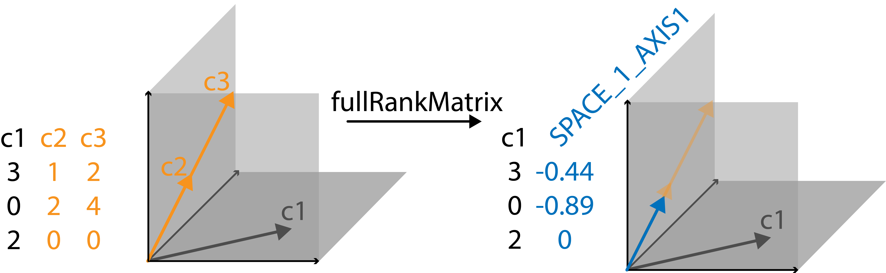

```{r, include = FALSE}
knitr::opts_chunk$set(
  collapse = TRUE,
  comment = "#>"
)
```

<!-- badges: start -->
<!-- badges: end -->

```{r, echo=FALSE, out.width="20%", fig.align = 'left'}

```

We developed `fullRankMatrix` primarily for one-hot encoded design matrices used in linear models. In our case, we were faced with a 1-hot encoded design matrix, that had a lot of linearly dependent columns. This happened when modeling a lot of interaction terms. Since fitting a linear model on a design matrix with linearly dependent columns will produce results that can lead to misleading interpretation (s. example below), we decided to develop a package that will help with identifying linearly dependent columns and replacing them with columns constructed of orthogonal vectors that span the space of the previously linearly dependent columns.

The goal of `fullRankMatrix` is to remove empty columns (contain only 0s), merge duplicated columns (containing the same entries) and merge linearly dependent columns. These operations will create a matrix of full rank. The changes made to the columns are reflected in the column headers such that the columns can still be interpreted if the matrix is used in e.g. a linear model fit.

## Installation

You can install `fullRankMatrix` directly from CRAN. Just paste the following snippet into your R console:

```r
install.packages("fullRankMatrix")
```


You can install the development version of `fullRankMatrix` from [GitHub](https://github.com/Pweidemueller/fullRankMatrix) with:

```r
# install.packages("devtools")
devtools::install_github("Pweidemueller/fullRankMatrix")
```

## Citation

If you want to cite this package in a publication, you can run the following
command in your R console:

```{r citation}
citation("fullRankMatrix")
```

## Linearly dependent columns span a space of a certain dimension
In order to visualize it, let's look at a very simple example. Say we have a matrix with three columns, each with three entries. These columns can be visualized as vectors in a coordinate system with 3 axes (s. image). The first vector points into the plane spanned by the first and third axis. The second and third vectors lie in the plane spanned by the first and second axis. Since this is a very simple example, we immediately spot that the third column is a multiple of the second column. Their corresponding vectors lie perfectly on top of each other. This means instead of the two columns spanning a 2D space they just occupy a line, i.e. a 1D space. This is identified by `fullRankMatrix`, which replaces these two linearly dependent columns with one vector that describes the 1D space in which column 2 and column 3 used to lie. The resulting matrix is now full rank with no linearly dependent columns.


```{r setup}
library(fullRankMatrix)
```

```{r}
c1 <- c(1, 0, 1)
c2 <- c(1, 2, 0)
c3 <- c(2, 4, 0)

mat <- cbind(c1, c2, c3)

make_full_rank_matrix(mat)
```
```{r, out.width="100%", fig.cap="Visualisation of identifying and replacing linearly dependent columns."}

```

## Worked through example

Above was a rather abstract example that was easy to visualize, let's now walk through the utilities of `fullRankMatrix` when applied to a more realistic design matrix.

When using linear models you should check if any of the columns in your design matrix are linearly dependent. If there are, this will alter the interpretation of the fit. Here is a rather constructed example where we are interested in identifying which ingredients contribute mostly to the sweetness of fruit salads. 
```{r}
# let's say we have 10 fruit salads and indicate which ingredients are present in each salad
strawberry <- c(1,1,1,1,0,0,0,0,0,0)
poppyseed <- c(0,0,0,0,1,1,1,0,0,0)
orange <- c(1,1,1,1,1,1,1,0,0,0)
pear <- c(0,0,0,1,0,0,0,1,1,1)
mint <- c(1,1,0,0,0,0,0,0,0,0)
apple <- c(0,0,0,0,0,0,1,1,1,1)

# let's pretend we know how each fruit influences the sweetness of a fruit salad
# in this case we say that strawberries and oranges have the biggest influence on sweetness
set.seed(30)
strawberry_sweet <- strawberry * rnorm(10, 4)
poppyseed_sweet <- poppyseed * rnorm(10, 0.1)
orange_sweet <- orange * rnorm(10, 5)
pear_sweet <- pear * rnorm(10, 0.5)
mint_sweet <- mint * rnorm(10, 1)
apple_sweet <- apple * rnorm(10, 2)

sweetness <- strawberry_sweet + poppyseed_sweet+ orange_sweet + pear_sweet +
  mint_sweet + apple_sweet 

mat <- cbind(strawberry,poppyseed,orange,pear,mint,apple)

fit <- lm(sweetness ~ mat + 0)
print(summary(fit))
```
As you can see `lm` realizes that "1 [column] not defined because of singularities" (`matorange` is not defined) but it doesn't indicate what columns it is linearly dependent with.

So if you would just look at the columns and not consider the `NA` further, you would interpret that `strawberry` and `poppyseed` are the biggest contributors to the sweetness of fruit salads.

However, when you look at the model matrix you can see that the `orange` column is a linear combination of the `strawberry` and `poppyseed` columns (or vice versa). So truly any of the three factors could contribute to the sweetness of a fruit salad, the linear model has no way of recovering which one given these 10 examples. And since we constructed this example we know that `orange` and `strawberry` are the sweetest and `poppyseed` contributes least to the sweetness.
```{r}
mat
```
To make such cases more obvious and to be able to still correctly interpret the linear model fit, we wrote `fullRankMatrix`. It removes linearly dependent columns and renames the remaining columns to make the dependencies clear using the `make_full_rank_matrix()` function.

```{r}
library(fullRankMatrix)
result <- make_full_rank_matrix(mat)
mat_fr <- result$matrix
space_list <- result$space_list
mat_fr
```

```{r}
fit <- lm(sweetness ~ mat_fr + 0)
print(summary(fit))
```
You can see that there are no more undefined columns. The columns `strawberry`, `orange` and `poppyseed` were removed and replaced with two columns (`SPACE_1_AXIS1`, `SPACE_1_AXIS2`) that are linearly independent (orthogonal) vectors that span the space in which the linearly dependent columns `strawberry`, `orange` and `poppyseed` lied.

The original columns that are contained within a space can be viewed in the returned `space_list`:
```{r}
space_list
```

In terms of interpretation the individual axes of the constructed spaces are difficult to interpret, but we see that the axes of the space of `strawberry`, `orange` and `poppyseed` show a significant association with the sweetness of fruit salads. A further resolution which of the three terms is most strongly associated with `sweetness` is not possible with the given number of observations, but there is definitely an association of `sweetness` with the space spanned by the three terms.

If only a subset of all axes of a space show a significant association in the linear model fit, this could indicate that only a subset of linearly dependent columns that lie within the space spanned by the significantly associated axes drive this association. This would require some more detailed investigation by the user that would be specific to the use case.
